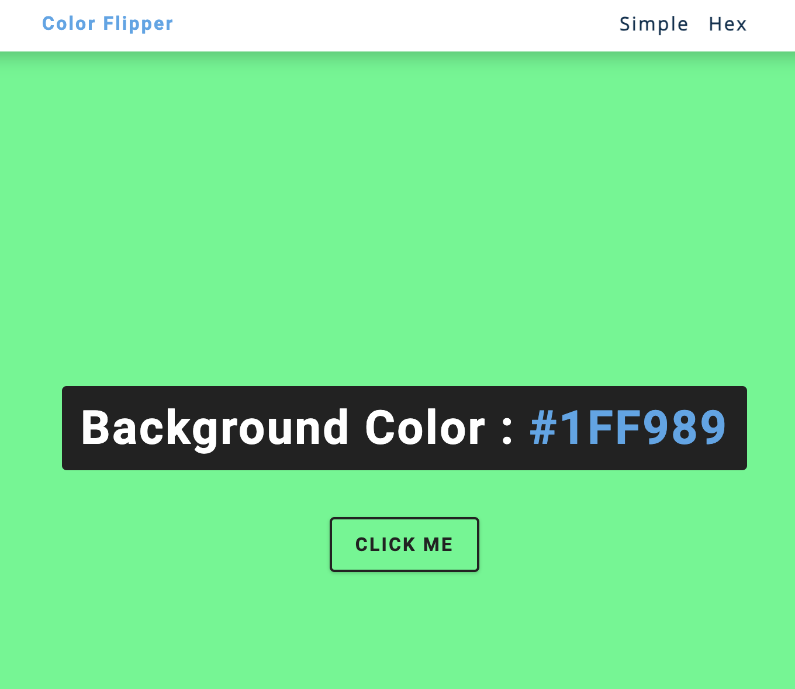

# Color Flipper Project

This project is a simple color flipper that allows users to change the background color with a click of a button. It comes in two versions: Simple and Hex. I did this following a freecodecamp.com tutorial that can be found [here](https://youtu.be/3PHXvlpOkf4?si=24oyKmnIX6DKkGcw)

## Table of Contents

- [Color Flipper Project](#color-flipper-project)
  - [Table of Contents](#table-of-contents)
  - [Simple Color Flipper](#simple-color-flipper)
    - [Usage](#usage)
    - [Files](#files)
  - [Hex Color Flipper](#hex-color-flipper)
    - [Usage](#usage-1)
    - [Files](#files-1)
  - [Project Structure](#project-structure)
  - [Purpose](#purpose)
  - [Getting Started](#getting-started)
    - [Prerequisites](#prerequisites)
    - [Installation](#installation)
  - [How to Use](#how-to-use)
  - [Contributing](#contributing)
  - [License](#license)

## Simple Color Flipper

### Usage

1. Open `index.html` in your browser.
2. Click the "click me" button to change the background color randomly.

### Files

- **index.html**: HTML file for the simple color flipper.
- **styles.css**: CSS file containing styling for the project.
- **app.js**: JavaScript file for the simple color flipper.

## Hex Color Flipper

### Usage

1. Open `hex.html` in your browser.
2. Click the "click me" button to generate a random hex color and change the background.

### Files

- **hex.html**: HTML file for the hex color flipper.
- **styles.css**: CSS file containing styling for the project.
- **hex.js**: JavaScript file for the hex color flipper.

## Project Structure

- **styles.css**: Contains the styling for the project.
- **app.js**: JavaScript file for the simple color flipper.
- **hex.js**: JavaScript file for the hex color flipper.

## Purpose

This project was created to practice basic Javascript.

## Getting Started

### Prerequisites

- Web browser (Chrome, Firefox, Safari, etc.)

### Installation

1. Clone the repository: `git clone https://github.com/federedd/color-flipper.git`
2. Navigate to the project directory: `cd color-flipper`

## How to Use

- Open `index.html` or `hex.html` in your preferred web browser.
- Click the "click me" button to change the background color.

## Contributing

Contributions are welcome! If you have improvements or feature suggestions, please open an issue or create a pull request.

## License

This project is licensed under the [MIT License](LICENSE).
